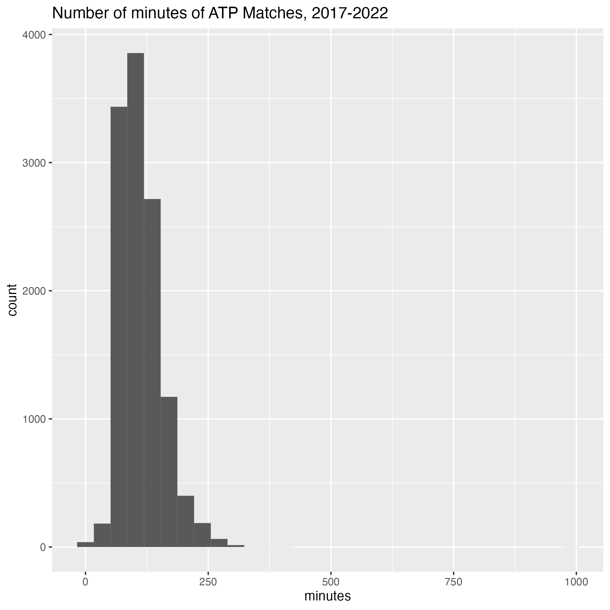
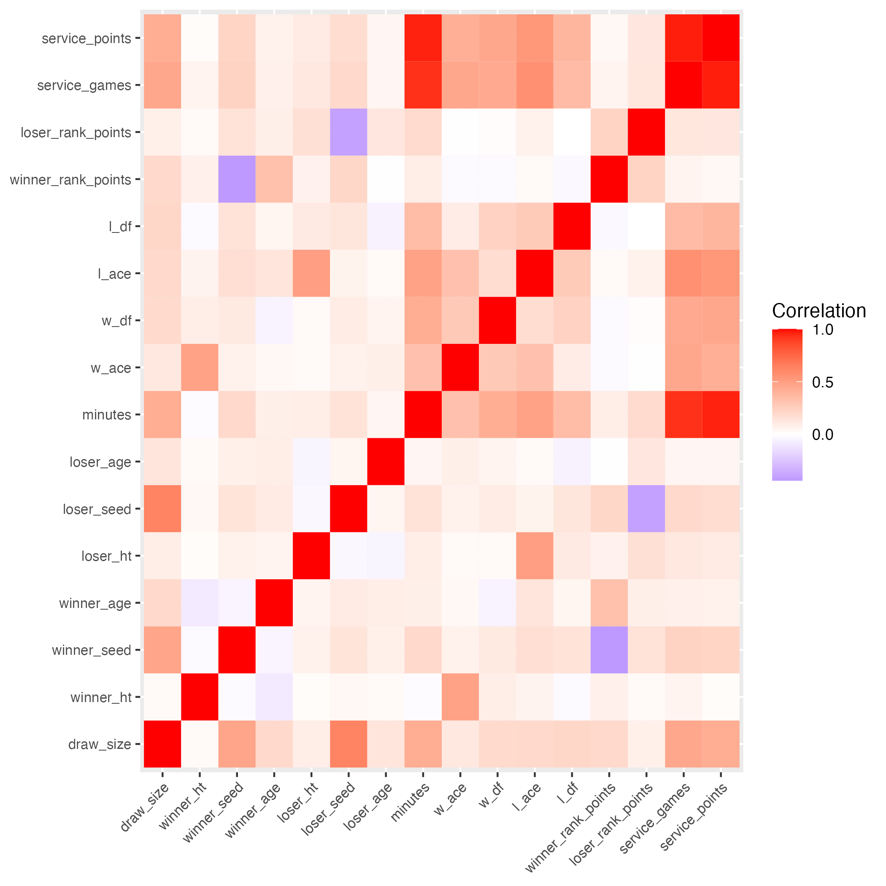
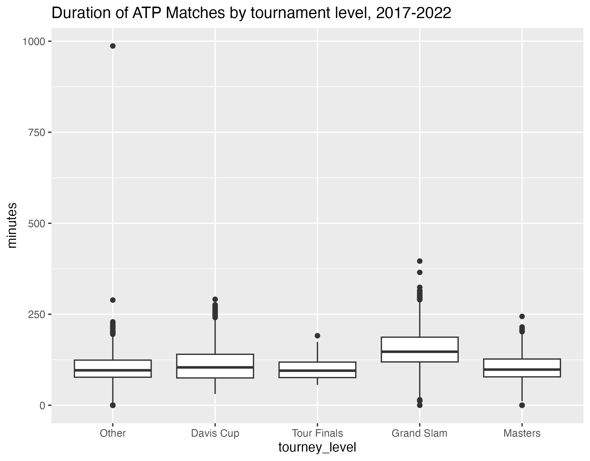
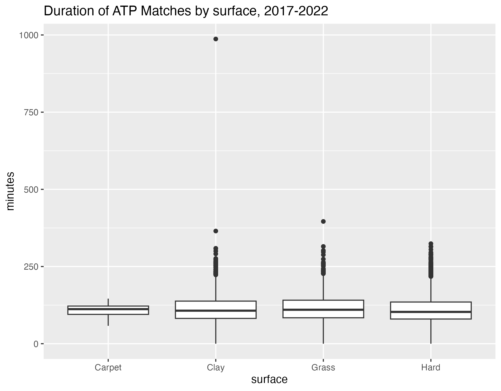
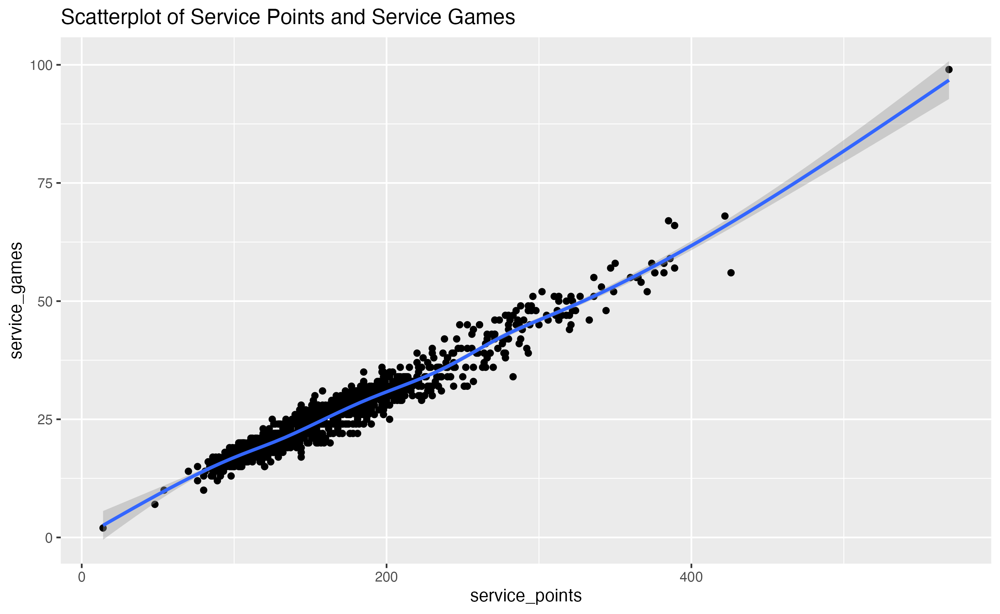
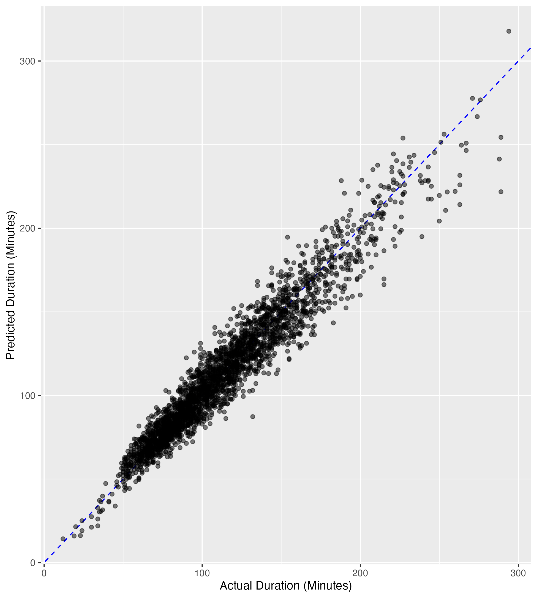

---
title: "Predictive Modeling of Duration of ATP Matches"
subtitle: |
  | Final Project 
  | Data Science 2 with R (STAT 301-2)
author: "Rohan Krishnamurthi"
date: today

format:
  html:
    toc: true
    embed-resources: true
    
execute:
  echo: false
  warning: false

from: markdown+emoji 
---

::: {.callout-tip icon=false}

## Github Repo Link

[https://github.com/stat301-2-2024-winter/final-project-2-rohankrishnamurthi2025](https://github.com/stat301-2-2024-winter/final-project-2-rohankrishnamurthi2025)

:::

# Introduction

The objective of this research project is to develop a model that will predict the duration in minutes of matches played as part of the Association of Tennis Professionals (ATP) circuit. The target variable is the number of minutes played in a match, and it is a quantitative variable. Thus, this research project examines a regression problem. 

I am an avid fan of the ATP and the sport of tennis as a whole. I am curious to know if data can be used to predict the number of minutes a match takes. This prediction model can be used by others to predict the length of matches played. This information can help tournament organizers in planning when to schedule matches and how many matches they should schedule in one day, in order to meet time constraints. It can also help players in estimating how long their matches will take and how much energy they should expend.

# Data Overview

I have downloaded one dataset that records the information for all matches on the ATP from 1968 to 2022. Each observation in the dataset corresponds to a match played. The dataset records the tournament, date, and round of each match, the loser and winner and their respective ranking, the breakdown of points played in the match, and other information.

## Dataset Link

Link to ATP data, 1968-2022:
[https://www.kaggle.com/datasets/sijovm/atpdata?resource=download](https://www.kaggle.com/datasets/sijovm/atpdata?resource=download)

## Data cleaning and preparation

The ATP data from 1968 to 2022 was read in and checked for missingness. In general, the data had substantial missingness in observations for earlier years, but had little to no missingness for more recent years (2012-2022). Due to the shear size of the raw dataset (188161 observations), only match data from 2017-2022 was sliced and used for this analysis (15726 observations). 

Multiple steps were then taken to prepare the dataset for analysis. The surface, hand, and type of entry, for both the match winner and loser, were converted to factor variables, as there are a finite number of options for these variables. The tournament level was recoded as a factor to more accurately reflect the different types of tournaments. The date, month, and year of the match were saved as unique variables. The service games and points won were also saved as new variables. Additionally, the listed ID of the tournament, winner and loser were removed, as these were assigned arbitrarily and are of no significance to the match. Finally, all observations with missing values for the number of minutes were removed, as this is the response variable of interest.

Imputing missing data in the dataset was not conducted. This is because variables used in this analysis had little to no missing values, so it was not deemed necessary. Variables with nearly complete cases were intentionally selected for this analysis.


```{r}
#| echo: false

library(tidyverse)
library(tidymodels)
library(janitor)
library(conflicted)
library(parsnip)
library(here)
library(skimr)
library(patchwork)
library(kknn)
tidymodels_prefer()

```


```{r}
#| echo: false

atp_matches <- read_rds("cleaned data/atp_matches.rds")

```


## Overview of variables
The cleaned dataset regarding matches from 2017 to 2022 contains 15088 observations, each corresponding to an individual match. As the objective of this project is to determine the number of minutes of a match (a regression problem), `minutes` is the target/response variable in this analysis. Potential predictor variables for this model include the classification variables of `surface`, `winner_seed` and `loser_seed`, and `winner_entry` and `loser_entry`, and `tournament`. Numeric variables include `winner_age` and `loser_age`, `winner_rank_points` and `loser_rank_points`, `winner_ht` and `loser_ht`, as well as all match statistics. The predictor variables utilized depend on the recipe developed and employed in each model.


## EDA of Response Variable

Upon plotting the distribution of `minutes`, it was found that the distribution is generally normal. The median number of minutes was 105 (1 hour, 45 minutes), and the mean minutes was 112.6. The data shows little to no skew. Since the distribution was generally normal, no transformations on the data were conducted. 

{#minutes_histogram}

The correlation matrix below was developed using rows of the training set with complete cases for numerical variables. The matrix shows how strongly correlated the numerical variables are with one another. It is evident that the variables vary greatly in their correlation with one another. One particularly strong correlation occurs between `minutes` and `service_points`.

{#cor_matrix}

It was also sought to assess how the duration of matches varies by qualitative, categorical variables. The duration of ATP matches by tournament level is shown in the boxplot @fig-level. One can see that Grand Slam matches are generally longer than matches of other levels. This makes sense, considering that Grand Slam matches are best of 5 sets, while matches of other levels are best of 3 sets, so players about to play longer on average.

{#fig-level}

The boxplot below shows how duration of matches varies by the surface. This boxplot does not provide particularly useful insights, as the boxes for the three main surfaces (clay, grass, and hard court) all have great degrees of overlap.  

{#fig-surface}


# Methods

## Data Splitting

The match data was split using stratified random sampling into a training set, containing 80% of the matches, and a testing set, containing 20% of the matches. The `minutes` variable was used as the strata for splitting data, as this is the predictor variable in this regression problem. The training dataset contains 12069 observations, and the testing dataset contains 3019 observations.

```{r}
#| echo: false

atp_train <- read.csv("cleaned data/atp_train.rds")
atp_test <- read.csv("cleaned data/atp_test.rds")
atp_folds <- read.csv("cleaned data/atp_folds.rds")

```


## Resampling

V-fold cross validation was then used to fold the data into non-overlapping folds, specifically using 5 folds and 3 repeats. The number of folds and repeats was selected given the size of the training dataset. Resampling was utilized due to the relatively low number of observations in the dataset. With this number of folds and repeats, the data will be fit 15 times for each model.

## Model Types

In this project, six different models were fitted to the datasets. A null model and an ordinary linear regression model served as baseline models for our predictions. A boosted tree model, random forest model, k-nearest neighbors model, and an elastic net model were also incorporated. The boosted tree model uses mtry, minimum nodes, and learning rate as tuning parameters, while the random forest model uses mtry, minimum nodes, and trees. The k-nearest neighbors model uses neighbors as the tuning parameters. Finally, the elastic net model incorporates penalty and mixture as tuning parameters.

Imputing missing data in the dataset was not conducted. This is because variables with little to no missing values were included in this analysis.

## Recipe Development

Three recipes were developed for this analysis: a default recipe, a recipe incorporating interactions between predictors, and a random forest recipe. Using the EDA and a general understanding of tennis logic, the predictor variables with some sizable correlation with `minutes` of a match were included in the recipe. These variables included the tournament level, match surface, numerical statistics regarding the winner and loser, and numerical statistics regarding the breakdown of points played. Variables that were believed to have little to no effect were excluded, such as the tournament itself, the player names, and the country of origin of the players. Certain variables had a direct impact on one another, so one was excluded (i.e. ranking points and ranking). In all of these recipes, all predictor variables were centered, and the numeric predictor variables were normalized.

The interaction recipe is similar to the default recipe, the only difference being that the interactive recipe includes interactions between variables that are correlated with each other (as shown in the EDA). This includes and `service_games` and `service_points`. The relationships of this pair of variables are shown in the scatterplot below. 


{#fig_points_games}
Both the default and the interaction recipe were used to develop the null, linear regression, k-nearest neighbor, and elastic net models.


One hot encoding was not used for the default and interaction recipes, while it was used for the random forest recipe. Interaction terms were not included for the random forest recipe, as one hot encoding makes them unnecessary. The random forest recipe was used to develop the boosted tree model and the random forest model.

# Model Building & Selection

The six models, developed with their respective recipes, were assessed by comparing the RMSE value for each of their predictions of match durations. The RMSE value was used because it measures the average number of minutes the model prediction duration differs from the actual duration of a match. Because no transformation were performed on the outcome variable itself, the RMSE values are in minutes. The minimum RMSE value was identified for each model and recipe combination, as it corresponds to the best performing model.

## Selection of Best Model

In the first table, @tbl-recipe-default,  the best performance of the models developed using the default recipe (with no interact terms) is shown. The model with the lowest RMSE value and best performance was the elastic net model. The model performed equally well when the penalty value was 0, 0.0031623, or 0.0000100, while the mixture value was 1.

```{r}
#| echo: false
#| label: tbl-recipe-default
#| tbl-cap: Best Performing Models for Default Recipe


load(here("tables/metrics_table.rda"))

metrics_table |> filter(recipe == "default") |> kableExtra::kable()


```

In the second table, @tbl-recipe-interact,  the best performance of the models developed using the interact recipe is shown. The model with the lowest RMSE value and best performance was the Elastic Net model again, and this time, the elastic net model performed better than with the default recipe. The model performed equally well when the penalty value was 0, 0.0031623, or 0.0000100, while the mixture value was 0.2875.

```{r}
#| echo: false
#| label: tbl-recipe-interact
#| tbl-cap: Best Performing Models for Interact Recipe


metrics_table |> filter(recipe == "interact") |> kableExtra::kable()

```

In the last table, @tbl-recipe-rf,  the best performance of the models developed using the random forest recipe is shown. The model with the lowest RMSE value and best performance was the random forest, while the boosted tree model performed worse. The random forest model performed best with the mtry parameter  set to 10,  the min_n parameter set to 2, and the trees parameter set to 1500. This model performed worse than the elastic net model with both the default and the interact recipe.

```{r}
#| echo: false
#| label: tbl-recipe-rf
#| tbl-cap: Best Performing Models for Random Forest Recipe


metrics_table |> filter(recipe == "random forest") |> kableExtra::kable()

```

Overall, from the RMSE values, the elastic net model developed with the interact recipe performed best with the penalty set to 0, 0.00001, or 0.00316, and the mixture set to 0.2875. These models' predictions of match duration had a root-mean-squared-error of 5.51 minutes. This is a fairly successful model, considering that the heavy majority of matches last one to three hours.

Additionally, the interact recipe performed slightly better than the default recipe for the elastic net and k-nearest neighbor models, while it performed the same for the null and linear regression models. This indicates that adding complexity through step interactions enhances model performance for the elastic net and k-nearest neighbor models. Second to the elastic net model, the random forest model had a relatively low RMSE value, so it performed the second best. The RMSE values for the linear regression, k-nearest neighbor, and boosted tree models were significantly higher, and the RMSE of the null model was substantially the highest.

It does not come as a suprise that the elastic net model performed so well. This type of model incorporates both the penalties of the lasso and ridge regression models to improve regularization of predictive models. This powerful combination of two models facilitates enhanced predictions. Moreover, it makes sense that the interact recipe enhanced predictions, as it accounts for relationships between predictor variables that the default recipe neglects.

The lowest standard error was utilized to essentially break the tie between the best performing elastic net models. The lowest standard error can be used to assess  the accuracy with which the sample-generated prediction estimates the actual match duration. This metric can be used to distinguish models' performances when RMSE values are close.

From the following table, @tbl-elastic-net, the mean RSQ values and standard error values of the best performing elastic net models are shown. The table shows that the three models had equal RSQ and standard error values. Thus, it could not be distinguished which of the three sets of parameters lead to the best model performance. The identical performance of these three sets of parameters can be attributed to a lack of specificity and complexity in the interact recipe, as well as a relatively small sample size being used to train the model. Increases in traning set size and enhanced complexity of the recipe could be used to differentiate the performances of these three sets of parameters. Nonetheless, considering that the penalty value is very close to 0 in all three cases, the sets of parameters are consistent with one another.

```{r}
#| echo: false
#| label: tbl-elastic-net
#| tbl-cap: Performance of Elastic Net Models


load(here("tables/en_interact_table.rda"))

en_table |> kableExtra::kable()

```


## Final Model Analysis

The final model was made by developing the elastic net model with the interact recipe and setting the penalty parameter to 0 and the mixture parameter to 0.2875. It was chosen to use 0 as the penalty parameter, as the three penalties corresponding to the best performing models all round down to 0. 
The actual durations and predicted durations by the final model were recorded. A glimpse of these predictions and their difference from the actual durations can be seen in @tbl-elastic-final-predictions. 

```{r}
#| echo: false
#| label: tbl-elastic-final-predictions
#| tbl-cap: Predictions of Final Elastic Net Model

load(here("tables/final_predictions.rda"))

head(final_predictions, n = 20) |> kableExtra::kable()

```

The following table, @tbl-elastic-final-metrics, shows the RMSE, RSQ, MAPE, and MAE values for the final model. The MAPE value of 7.35 confirms that the average deviation people forecasted and actual values for the duration of matches is small. Additionally, the RSQ value of 0.933, very close to 1, indicates that the `minutes` data fits the final model particularly well.

```{r}
#| echo: false
#| label: tbl-elastic-final-metrics
#| tbl-cap: Predictive Metrics of Final Elastic Net Model

load(here("tables/pred_metrics.rda"))

pred_metrics |> kableExtra::kable()

```

Lastly, the following scatterplot shows the direct relationship of the actual and predicted durations of matches (in minutes). The plot shows that actual and predicted values increase with an approximately 1:1 slope, indicating that they are proportionate to each other. However, the data points have sizable deviation from the line of best fit, indicating that the model still has significant error. Deviations from the line of best fit appear to increase for longer matches overall, indicating that the model can be especially improved in predicting the duration of relatively long matches.


{#minutes_plot}
Overall, the elastic net model with the interact recipe and this set of parameters performed successfully in predicting duration of matches. The model performed particularly well at predicting the duration of shorter matches. The strong correlation of the model's predictions and actual values indicate that developing more intricate models, such as the elastic net model, as worthwhile. 


# Conclusion and Next Steps

The elastic net model developed using the interact recipe (with mtry set to 0.2875 and penalty set to 0, 0.00001, and 0.0031623), was found to be the best at predicting the duration of tennis matches. Overall, minimizing the penalty of the elastic net model enhanced the model's performance greatly. 

The findings of this project can be refined by incorporating more tennis match data, such as from years before 2017. Additionally, other predictors can be incorporated regarding the information of players (the playing style, history of previous matches) and the match itself (i.e. the weather conditions, the time of day, etc.). As mentioned earlier, increasing the size of the training dataset, and refining the complexity of the interact recipe, can optimize the final elastic net model's performance.

To extend analysis of this project, the models and recipes developed can be applied to other datasets. For example, the same models can be used on the data of the Women's Tennis Association (WTA), to predict match duration for women's tennis matches. The methods used will slightly differ in that all women's matches are best of three sets, while men's matches vary between best of three and best of five sets. Additionally, the models can be applied to data regarding doubles matches on both the ATP and WTA. The methods will differ as well in that the information regarding both players on a doubles team must be accounted for when developing recipes and models. Overall, the applications of this research will help tournament organizers in predicting the length of matches of all divisions, as well as help playeres in estimating how much energy they will expend in their matches.


# References

"Elevating Tennis Performance: ATP & TDI Unveil Tennis IQ Analytics Platform." Association of Tennis Professionals 2023.
<https://www.atptour.com/en/news/atp-tdi-unveil-tennis-iq-analytics-platform>

"Data takes Center Court at the Women’s Tennis Association with SAP BTP." Women's Tennis Association. 2023.
<https://www.wtatennis.com/news/3646982/data-takes-center-court-at-the-women-s-tennis-association-with-sap-btp>

"Analytics in Tennis Has Been an Evolution, Not a Revolution." The New York Times. 2022.
<https://www.nytimes.com/2022/08/27/sports/tennis/us-open-analytics-data.html>

